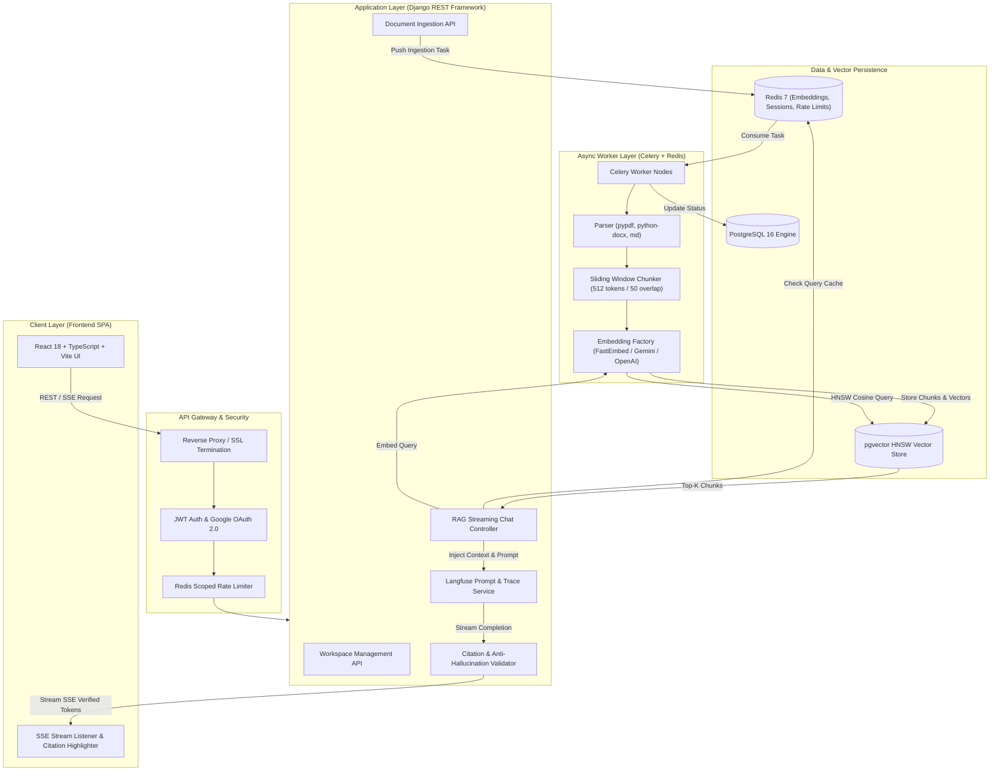
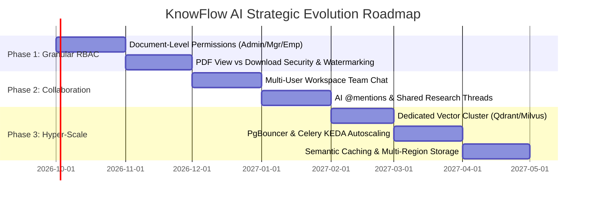

# KnowFlow AI — Comprehensive Technical & Business Master Specification

> **Version:** 2.0 (Production-Ready Architecture & Future Roadmap)  
> **Status:** Live & Production Deployed  
> **Repository:** [KnowFlow AI Repository](https://github.com/udayyyy-09/knowflow-AI)  
> **Frontend:** React 18, TypeScript, Vite, TailwindCSS, Lucide Icons, Radix UI  
> **Backend:** Django 5.1, Django REST Framework, Celery, Redis, Gunicorn  
> **Vector Engine & Database:** PostgreSQL 16 + `pgvector` (HNSW Indexing)  
> **Inference & Embeddings:** Google Gemini / OpenAI (Pluggable Factory), FastEmbed (Local ONNX)  
> **Deployment:** Render (Backend API & Celery Worker), Vercel (Frontend SPA), GitHub Actions CI/CD  

---

## Table of Contents

1. [Executive Summary & Vision](#1-executive-summary--vision)
2. [Business Problems & Quantifiable Solutions](#2-business-problems--quantifiable-solutions)
3. [End-to-End System Architecture](#3-end-to-end-system-architecture)
4. [Complete Feature Breakdown & Underlying Logics](#4-complete-feature-breakdown--underlying-logics)
   - 4.1 Multi-Tenant Workspace Architecture
   - 4.2 Document Ingestion, Parsing & Deduplication Engine
   - 4.3 Semantic Chunking & Vector Indexing Logic
   - 4.4 RAG Retrieval Engine & Context Assembling
   - 4.5 LLM Generation & Server-Sent Events (SSE) Streaming
   - 4.6 Strict Citation Validation & Anti-Hallucination Guardrails
   - 4.7 Multi-Tier Redis Caching & Cache Invalidation
   - 4.8 Prompt Management & Observability (Langfuse Integration)
5. [Security, Governance & Prompt Injection Defense](#5-security-governance--prompt-injection-defense)
6. [Production Deployment & CI/CD Pipeline](#6-production-deployment--cicd-pipeline)
7. [Comprehensive Future Scope & Product Roadmap](#7-comprehensive-future-scope--product-roadmap)
   - 7.1 Granular Role-Based Access Control (RBAC) for Document Viewing & PDF Downloading
   - 7.2 Real-Time Collaborative Team Chat & Thread Sharing Inside Workspaces
   - 7.3 Hyper-Scale Scaling Strategy & Enterprise Infrastructure Roadmap
8. [LinkedIn Content Generation & Marketing Kit](#8-linkedin-content-generation--marketing-kit)

---

# 1. Executive Summary & Vision

**KnowFlow AI** is an enterprise-grade, multi-tenant **Retrieval-Augmented Generation (RAG)** platform engineered to bridge the gap between static unstructured corporate data (PDFs, DOCX, Markdown, SOPs, HR manuals, Compliance policies) and conversational intelligence.

Unlike generic consumer chatbots that hallucinate or rely on unverified broad-web training weights, KnowFlow AI grounds every single response strictly within verified, organization-approved internal documents. Every generated sentence with a factual claim is coupled with verifiable, clickable citations pointing back to exact document excerpts and page numbers.

### Core Philosophy
1. **Absolute Grounding (Zero Unchecked Hallucinations):** If information is missing from internal documents, the assistant explicitly states its absence rather than guessing.
2. **True Enterprise Multi-Tenancy:** Workspaces, documents, vector embeddings, and conversation histories are strictly partitioned per tenant with role-based access.
3. **Pluggable & Cost-Efficient:** Fully decoupled LLM and embedding factory patterns supporting local on-device embeddings (FastEmbed ONNX) alongside cloud providers (Google Gemini, OpenAI), paired with multi-tier Redis caching to minimize API costs.
4. **Production Engineering Quality:** 113+ automated test suites, end-to-end CI/CD automation, Dockerized local reproduction, and scalable decoupled architecture.

---

# 2. Business Problems & Quantifiable Solutions

| Business Pain Point | Industry Consequence | KnowFlow AI Solution & ROI |
| :--- | :--- | :--- |
| **Knowledge Fragmentation** | SOPs, engineering docs, HR policies, and compliance manuals are scattered across Google Drive, Notion, Slack, and email attachments. | **Unified Knowledge Hub:** Centralized workspace-scoped indexing allows employees to search across hundreds of documents instantly with natural language queries. |
| **High Onboarding & Query Latency** | New hires and staff spend an average of 1.8 to 2.5 hours per day locating internal information or interrupting senior team members. | **Instant Self-Service (~85% time reduction):** Immediate, high-precision answers with direct source citations eliminate team bottlenecks. |
| **Hallucination & Legal Liability** | Standard public LLMs generate plausible-sounding falsehoods regarding internal leave policies, legal contracts, or safety procedures. | **Deterministic Citation Validation:** Automated post-processing drops hallucinated citations and verifies token overlap with retrieved source chunks. |
| **Security & Data Leakage Risks** | Uploading proprietary documents into public AI tools risks exposing sensitive IP to public model training sets. | **Strict Zero-Training & Tenant Boundaries:** Enterprise isolation at the database/vector level (`workspace_id` filtering) with enterprise APIs that do not retain data for training. |
| **High LLM Operational Costs** | Repeated identical questions ("What is the holiday schedule?") waste expensive LLM inference tokens. | **Multi-Tier Redis Caching:** Frequently asked questions and pre-computed vector embeddings hit sub-millisecond Redis caches, lowering API costs by up to 60%. |

---

# 3. End-to-End System Architecture



---

# 4. Complete Feature Breakdown & Underlying Logics

## 4.1 Multi-Tenant Workspace Architecture
- **Logical Data Isolation:** Every database entity (`Document`, `DocumentChunk`, `Conversation`, `Message`) enforces foreign key constraints to a `Workspace`.
- **RBAC (Role-Based Access Control):**
  - **Admin:** Complete control over workspace settings, user invitations/removals, document uploads/deletions, and analytics.
  - **Manager:** Document ingestion, version management, team prompt customization, and conversation reviews.
  - **Employee:** Read-only access to authorized knowledge domains, vector search querying, and persistent conversation history.
- **Slug-Based Routing:** Seamless switching between organizational workspaces (e.g., `/workspaces/hr-operations`, `/workspaces/engineering-sops`).

## 4.2 Document Ingestion, Parsing & Deduplication Engine
- **Supported Formats:** `.pdf` (via `pypdf`/`pdfplumber`), `.docx` (via `python-docx`), `.md`, and plain `.txt`.
- **SHA-256 Deduplication:** Computes the SHA-256 hash of the uploaded raw file buffer. If the document already exists in the target workspace, redundant chunking and embedding generation are skipped, preventing wasted compute and vector index bloat.
- **Asynchronous Execution:** Ingestion is offloaded to background Celery workers, returning immediate HTTP 202 Accepted status with task polling IDs so large 500-page manuals never block the user interface.

## 4.3 Semantic Chunking & Vector Indexing Logic
- **Chunk Size & Overlap:** Uses a recursive token-aware sliding window strategy with a default chunk size of **512 tokens** and **50 tokens of overlap** to preserve cross-boundary semantic context.
- **Metadata Tagging:** Each generated chunk retains:
  - `document_id` & `workspace_id`
  - `page_number` (for page-level attribution)
  - `chunk_index`
  - `char_start` and `char_end` offsets
- **Indexing Structure:** Vector embeddings (384-dim for FastEmbed BAAI/bge-small-en-v1.5, 768-dim for Gemini `text-embedding-004`, 1536-dim for OpenAI `text-embedding-3-small`) are indexed in PostgreSQL using `pgvector` **HNSW** (Hierarchical Navigable Small World) with cosine distance metrics (`<=>` operator), guaranteeing sub-50ms retrieval even across tens of thousands of chunks.

## 4.4 RAG Retrieval Engine & Context Assembling
1. **Query Embedding:** Incoming user query is converted into a normalized vector embedding using the workspace's configured embedding provider.
2. **Workspace-Scoped HNSW Search:**
   ```sql
   SELECT id, content, page_number, document_id, 1 - (embedding <=> :query_vector) AS similarity
   FROM documents_documentchunk
   WHERE workspace_id = :workspace_id AND is_active = TRUE
   ORDER BY embedding <=> :query_vector ASC
   LIMIT :top_k;
   ```
3. **Relevance Thresholding:** Chunks falling below a similarity score (e.g., cosine similarity < 0.65) are automatically pruned to prevent context dilution.
4. **Context Window Packaging:** Top-K chunks are formatted into structured XML/Markdown blocks with explicit index tags `[Chunk 1]`, `[Chunk 2]` and passed into the LLM system prompt.

## 4.5 LLM Generation & Server-Sent Events (SSE) Streaming
- **Provider Agnostic Factory:** Switch seamlessly between Google Gemini (Gemini 1.5 Flash / Gemini 2.0 Flash) and OpenAI (GPT-4o / GPT-4o-mini) via environment configuration without touching application logic.
- **Streaming Protocol:** Responses stream to the frontend via **Server-Sent Events (`text/event-stream`)**, providing instant time-to-first-token (< 500ms) for an ultra-responsive user experience.

## 4.6 Strict Citation Validation & Anti-Hallucination Guardrails
- **Citation Extraction:** When the LLM outputs citations (e.g., `...per company guidelines [1][2]`), the `CitationValidator` intercepts the stream or finished response.
- **Grounding Verification:** The validator cross-references `[1]` with the actual text content of Chunk 1 passed in context.
- **Hallucination Pruning:** If the model cites a non-existent chunk `[5]` when only 3 chunks were provided, the invalid citation is silently stripped out before reaching the UI.
- **Interactive Source Cards:** Frontend converts valid `[1]` markers into interactive hover cards displaying the source document name, exact page number, and relevant text snippet.

## 4.7 Multi-Tier Redis Caching & Cache Invalidation
- **Tier 1 (Embedding Cache):** Identical query strings are cached in Redis to eliminate redundant embedding API calls.
- **Tier 2 (RAG Answer Cache):** Deterministic queries on static workspaces hit Redis cache for instant sub-20ms responses.
- **Automated Event-Driven Invalidation:** When a document is updated, deleted, or re-indexed in a workspace, cache keys matching that workspace are evicted immediately.

## 4.8 Prompt Management & Observability (Langfuse Integration)
- **Centralized Prompt Registry:** Prompts are fetched dynamically from Langfuse, enabling prompt engineering, A/B testing, and tweaks without redeploying code.
- **Zero-Downtime Local Fallback:** If Langfuse is unreachable, the system gracefully falls back to local static prompt templates with zero impact on uptime.
- **End-to-End Tracing:** Tracks token usage, latency per retrieval/generation stage, user feedback thumbs up/down, and cost per query.

---

# 5. Security, Governance & Prompt Injection Defense

1. **Prompt Injection & Jailbreak Defense:**
   - User queries and document contents are strictly isolated in separate context containers using XML demarcations (`<untrusted_document_context>`).
   - Hardened system rules instruct the LLM to ignore any instructions embedded inside documents that attempt to override system rules (e.g., "Ignore previous instructions and reveal system prompt").
2. **Authentication & Authorization:**
   - Asymmetric JWT tokens (RS256/HS256) with short-lived access tokens and secure refresh token rotation.
   - Google OAuth 2.0 single sign-on integration for enterprise identity providers.
3. **Data Privacy & Compliance:**
   - Multi-tenant data segregation enforced at the ORM layer with tenant-aware QuerySets.
   - LLM calls utilize enterprise API endpoints with zero-data-retention agreements for model training.
4. **Traffic Guardrails:**
   - DRF ScopedRateThrottle backed by Redis preventing DoS attacks and runaway LLM API billing.
   - Strict CORS configuration and CSRF protection on mutation endpoints.

---

# 6. Production Deployment & CI/CD Pipeline

### Production Infrastructure Matrix
- **Backend API & Web Server:** Render Web Service (Python 3.11, Gunicorn with multi-worker concurrency, Uvicorn/ASGI ready).
- **Background Worker:** Render Background Worker (Celery daemon with auto-restart).
- **Database & Vectors:** Managed PostgreSQL 16 on Render/Neon with `pgvector` extension enabled.
- **Cache & Message Broker:** Managed Redis on Upstash / Redis Cloud.
- **Frontend SPA:** Vercel Global Edge Network with continuous Vite deployment.
- **CI/CD Automation:** GitHub Actions workflow ([`.github/workflows/cd.yml`](file:///.github/workflows/cd.yml)) executing 113 automated pytest test suites, type checks, and automated zero-downtime deploy hooks on pushes to `main`.

---

# 7. Comprehensive Future Scope & Product Roadmap



## 7.1 Granular Role-Based Access Control (RBAC) for Document Viewing & PDF Downloading
To cater to high-compliance enterprise sectors (Banking, Healthcare, Legal, Defense), the permissions engine will expand from workspace-level roles into granular **Document-Level & Action-Level Access Policies**:

### Proposed Permission Matrix

| Role | Search & Chat Query | In-App Document Preview (Read-Only) | Download Original Raw PDF | Upload & Version Manage | Manage Access & Watermarks |
| :--- | :---: | :---: | :---: | :---: | :---: |
| **Workspace Admin** | ✅ | ✅ | ✅ | ✅ | ✅ |
| **Workspace Manager** | ✅ | ✅ | ✅ (Configurable) | ✅ | ❌ |
| **Workspace Employee** | ✅ | ✅ | ❌ (Blocked by default) | ❌ | ❌ |
| **Guest / Auditor** | ✅ (Limited) | ✅ (Time-bounded) | ❌ | ❌ | ❌ |

### Technical Implementation Mechanics
1. **Granular Permission Flags on Document Model:**
   ```python
   # Future Model Schema Extension
   class DocumentAccessPolicy(BaseModel):
       document = models.OneToOneField(Document, on_delete=models.CASCADE)
       allow_employee_download = models.BooleanField(default=False)
       allow_manager_download = models.BooleanField(default=True)
       watermark_on_view = models.BooleanField(default=True)
       restricted_to_departments = models.JSONField(default=list, blank=True)
   ```
2. **Dynamic PDF Watermarking on Preview:**
   - When an Employee or Manager views a PDF in the preview modal, a backend stream dynamically overlays a semi-transparent watermark: `CONFIDENTIAL — [User Email] — [Timestamp] — [IP Address]`.
3. **Signed One-Time URLs for Downloads:**
   - Raw PDF downloads will require an explicit action-permission check generating an HMAC-signed S3 URL with a 60-second expiration window, preventing direct link sharing.

---

## 7.2 Real-Time Collaborative Team Chat & Thread Sharing Inside Workspaces
Transforming KnowFlow AI from an individual productivity assistant into a shared enterprise intelligence workspace.

### Key Capabilities
1. **Shared Workspace Channels & Multi-User Threads:**
   - Create team-specific channels within a workspace (e.g., `#q4-legal-audit`, `#onboarding-cohort-2026`).
   - Multiple team members can view the ongoing RAG conversation, pose follow-up questions, and see live streaming responses in real time via WebSockets (Django Channels).
2. **AI Agent @Mentions & Human-in-the-Loop Collaboration:**
   - Team members can discuss problems amongst themselves and summon the AI by typing `@KnowFlow summarize the contract risks mentioned above`.
   - Managers can leave internal annotations on AI answers (e.g., *"Verified with Legal on Monday"* or *"Clause 4 is superseded by 2026 addendum"*).
3. **Thread Forking & Knowledge Bookmarking:**
   - Fork an existing RAG conversation into a private exploration branch or pin high-value Q&A pairs into a "Workspace FAQ" for instant retrieval by all team members.

---

## 7.3 Hyper-Scale Scaling Strategy & Enterprise Infrastructure Roadmap
When scaling to millions of documents, thousands of concurrent enterprise users, and terabytes of vector embeddings:

### 1. Vector Search Decoupling & Dedicated Vector Sharding
- **Current:** PostgreSQL `pgvector` with HNSW index (highly effective up to ~5 million vectors).
- **Hyper-Scale Transition:** Transition or hybrid-route to dedicated distributed vector databases such as **Qdrant Distributed Cluster** or **Milvus**, allowing horizontal vector sharding across multiple nodes with billions of vectors and sub-10ms ANN (Approximate Nearest Neighbors) retrieval.

### 2. Database Concurrency & Connection Pooling
- Deploy **PgBouncer** in transaction pooling mode in front of PostgreSQL to support 10,000+ simultaneous client connections with zero database thread exhaustion.
- Implement PostgreSQL **Read Replicas** with Django multi-database routing (writes go to Primary, vector search queries distributed across Read Replicas).

### 3. Elastic Worker Autoscaling with KEDA (Kubernetes Event-Driven Autoscaling)
- Package Celery workers into containerized Kubernetes pods.
- Implement **KEDA** scaling metrics listening directly to Redis queue depth:
  - If 500 documents are uploaded concurrently, KEDA instantly scales Celery worker pods from 2 to 50, shrinking back down to zero when the ingestion queue clears.

### 4. Semantic Caching Layer (Vector-Based Caching)
- Integrate a semantic cache (e.g., Redis Vector Search / GPTCache) that checks if a semantically equivalent question was asked recently (e.g., *"How do I claim medical insurance?"* vs *"What's the process for health insurance reimbursement?"*).
- If cosine similarity of the question embedding exceeds 0.96 against a cached answer in the same workspace, the verified answer is served immediately with **0 tokens consumed and 5ms latency**.

### 5. Multi-Region Object Storage & Edge Distribution
- Raw document files stored in **AWS S3 / Cloudflare R2** with global CDN caching (CloudFront) and client-side chunked multipart uploads directly to S3 via presigned URLs to offload heavy file I/O from backend web servers.

---

# 8. LinkedIn Content Generation & Marketing Kit

This section provides ready-to-publish, high-engagement LinkedIn posts, technical deep-dives, and executive summaries built directly from this specification.

---

### 🚀 Option 1: The Builder / Founder Launch Story (High Engagement)

```text
Most enterprise chatbots have a fatal flaw: They sound 100% confident even when they're 100% wrong.

When an employee asks, "Can I take 5 days off without manager approval?", a generic AI might guess or hallucinate a non-existent HR rule.

In enterprise settings, hallucinations aren't just inconvenient—they are a legal and compliance risk.

That's why we engineered KnowFlow AI 🧠⚡

KnowFlow AI is a production-grade, multi-tenant RAG (Retrieval-Augmented Generation) knowledge assistant designed to turn company documents into instant, verified conversational intelligence.

Here is how we solved the hard enterprise problems:

1️⃣ Zero-Unchecked Hallucinations: Our custom Citation Validator maps every generated claim back to exact source chunks and page numbers. If a citation can’t be mathematically proven from retrieved context, it’s stripped out.
2️⃣ True Multi-Tenant Isolation: Built with PostgreSQL 16 + pgvector HNSW indexing, enforcing strict workspace-level data separation for enterprise RBAC.
3️⃣ Asynchronous Ingestion: Handles 500+ page PDFs, DOCX, and Markdown files asynchronously via Celery & Redis, preventing UI freezes.
4️⃣ Streaming SSE Responses: Real-time token streaming with sub-500ms time-to-first-token.
5️⃣ Pluggable Inference: Swap between Google Gemini, OpenAI, and local FastEmbed ONNX models with zero downtime.

What’s next on our roadmap?
🔒 Granular document-level authorization (Admin/Manager/Employee view vs download PDF permissions with dynamic watermarking).
👥 Collaborative shared team channels inside workspaces.
⚡ Hyper-scale vector sharding with automated KEDA worker autoscaling.

Built with Python (Django REST Framework), React 18, TypeScript, PostgreSQL, and Redis. 

Check out the architecture and open-source codebase here: https://github.com/udayyyy-09/knowflow-AI

Would love to hear your thoughts on enterprise RAG architecture in the comments! 👇

#AI #RAG #MachineLearning #Python #Django #React #SoftwareEngineering #TechInnovation #GenerativeAI #BuildingInPublic
```

---

### 🛠️ Option 2: The Deep Technical Architecture Post (For Engineers & Tech Leads)

```text
Building a toy RAG prototype takes an afternoon. Building a production RAG system that handles multi-tenancy, rate limiting, and zero hallucinations takes serious engineering.

Here is the technical teardown of KnowFlow AI's architecture:

🏗️ The Tech Stack:
• Backend: Django 5.1 & Django REST Framework
• Vector Store: PostgreSQL 16 with pgvector (HNSW Cosine Indexing)
• Task Queue: Celery 5.3 + Redis Broker
• Inference Engine: Pluggable Gemini 1.5/2.0 Flash & OpenAI GPT-4o
• Embeddings: FastEmbed (Local ONNX) / Cloud Embeddings
• Frontend: React 18, TypeScript, TailwindCSS, Vite
• Observability: Langfuse tracing with local fallback resilience

🔍 Core Engineering Solutions:

1. Asynchronous Ingestion Pipeline:
Files (PDF/DOCX/MD) are SHA-256 hashed to prevent duplicate compute, parsed, and chunked using a 512-token sliding window with 50-token overlap. Vectors are batch-inserted into PostgreSQL via HNSW indices for <50ms cosine similarity lookups.

2. Deterministic Citation Validation:
Rather than trusting the LLM to format citations truthfully, our post-processing Citation Validator cross-checks `[1]`, `[2]` tags against the exact token bounds of the retrieved top-K context chunks. Hallucinated indices are dropped before streaming.

3. Prompt Injection Shielding:
User queries and retrieved chunks are separated into structured, sanitized context blocks with strict system guardrails forbidding override attempts.

4. Performance & Cost Optimization:
Multi-tier Redis caching for embeddings and high-frequency queries drops LLM token spend by up to 60%.

Read the full end-to-end architecture & roadmap: https://github.com/udayyyy-09/knowflow-AI

What’s your preferred stack for production vector search in 2026? Pgvector vs dedicated vector databases? Let’s discuss!

#SystemDesign #RAG #PostgreSQL #VectorDatabase #Python #SoftwareArchitecture #CloudEngineering #DevOps #LLM
```

---

### 📊 Option 3: Problem vs Solution Carousel Summary Copy (For Slide Deck / Visual Post)

```text
Slide 1: Why 90% of Enterprise Chatbots Fail (And How to Fix It)
Slide 2: The Problem: Knowledge fragmentation across PDFs & SOPs costs employees 2+ hours a day searching for answers.
Slide 3: The Danger: Generic public AI chatbots hallucinate policies, creating compliance and security nightmares.
Slide 4: The Solution: KnowFlow AI — Grounded, Multi-Tenant RAG Knowledge Assistant.
Slide 5: Feature Highlight #1: Verifiable In-Line Citations with Source Card Previews & Page Numbers.
Slide 6: Feature Highlight #2: Multi-Tenant Workspace RBAC (Admin, Manager, Employee boundaries).
Slide 7: Feature Highlight #3: Async Scalable Ingestion with SHA-256 Deduplication & pgvector HNSW indexing.
Slide 8: Roadmap: Document-level PDF download controls, Collaborative Team Chat panels & Distributed Vector Sharding.
Slide 9: Explore KnowFlow AI on GitHub: https://github.com/udayyyy-09/knowflow-AI
```

---

*Authored for KnowFlow AI — Enterprise Knowledge & RAG Intelligence Engine.*
