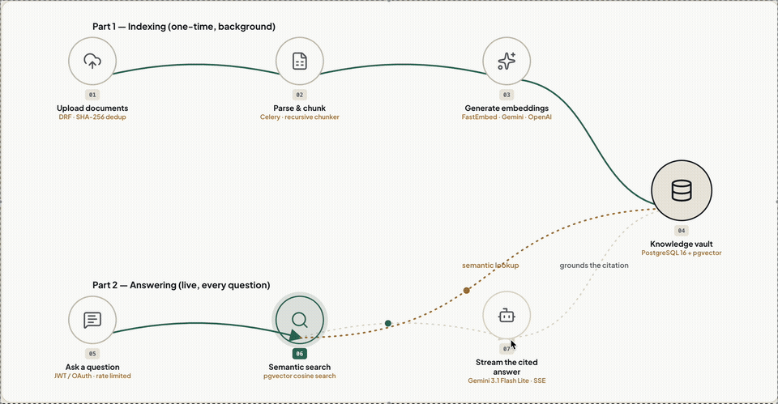

# KnowFlow AI

**An enterprise-grade, multi-tenant Retrieval-Augmented Generation (RAG) assistant that turns company documents into a conversational, citation-backed knowledge base.**

[](https://www.python.org/)
[](https://www.djangoproject.com/)
[](https://www.django-rest-framework.org/)
[](https://github.com/pgvector/pgvector)
[](#quality--testing)
[](LICENSE)

---

## Flow

<p align="center">
  
</p>

## Overview

KnowFlow AI lets employees ask natural-language questions — "What's our PTO policy?", "How do I file an expense report?" — and get accurate, grounded answers pulled directly from their organization's own documents, with inline citations back to the source. It's built as a real multi-tenant SaaS backend, not a single-user demo: workspaces, roles, and document collections are fully isolated per organization.

## The Problem

Company knowledge is scattered across PDFs, Word docs, and wikis that employees either can't find or don't read. The usual fallback — pinging a coworker or manager — doesn't scale and produces inconsistent, sometimes wrong answers. Generic chatbots don't solve this either: without grounding in a company's actual documents, an LLM will confidently answer from general training knowledge or simply hallucinate a policy that doesn't exist.

## The Solution

KnowFlow AI combines document retrieval with LLM generation so every answer is traceable to a real source, not invented.

**Business impact**
- Employees get instant, self-service answers instead of waiting on a colleague or searching through folders.
- Every claim carries a clickable citation, so answers stay auditable — critical for HR, compliance, and legal content.
- Multi-tenant workspaces mean one deployment can serve many teams or clients with strict data isolation.
- Response caching and a local embedding option keep inference costs and latency low at scale.

**Technical approach**
- Documents are parsed, chunked, and embedded into PostgreSQL via `pgvector`, scoped per workspace.
- A user's question is embedded, matched against the workspace's document chunks via HNSW cosine similarity search, and only the top-relevant, permission-checked chunks are passed to the LLM.
- The LLM is instructed to answer strictly from retrieved context, with inline `[1]`, `[2]` citations validated and mapped back to their source chunks — hallucinated citations are automatically dropped.
- Answers stream back token-by-token over Server-Sent Events for a responsive chat experience.

## Key Features

- 🔐 **JWT + Google OAuth authentication** with multi-tenant workspace-scoped RBAC (Admin / Manager / Employee)
- 📄 **Multi-format ingestion** (PDF, DOCX, Markdown, plain text) with async Celery processing and SHA-256 deduplication
- 🔎 **Semantic vector search** with pluggable embedding providers (local ONNX, Gemini, OpenAI)
- 💬 **Streaming RAG chat** with verifiable inline citations, source snippets, and similarity scores
- 🛡️ **Prompt injection defense** — untrusted document content is isolated in structured, sanitized context blocks
- ⚡ **Multi-tier caching** (embeddings, answers, permissions) with automatic invalidation on document changes
- 📊 **Langfuse-backed prompt management** — versioned, hot-swappable prompts with zero-downtime fallback
- 🚦 **Rate limiting & cost guardrails** to keep LLM spend predictable
- 🧪 **98 automated tests**, >85% coverage across core apps

## Tech Stack

| Layer | Technology |
|---|---|
| Backend | Django 5.1, Django REST Framework |
| Database | PostgreSQL 16 + pgvector |
| Async / Queue | Celery, Redis |
| LLM | Gemini / OpenAI (pluggable, factory pattern) |
| Embeddings | FastEmbed (local ONNX), Gemini, OpenAI |
| Observability | Langfuse |
| Auth | SimpleJWT, Google OAuth 2.0 |

## Quick Start

```bash
git clone https://github.com/udayyyy-09/knowflow-AI.git
cd knowflow-AI
docker-compose up -d          # PostgreSQL + Redis

cd backend
python3 -m venv .venv && source .venv/bin/activate
pip install -r requirements.txt
cp .env.example .env          # add your API keys

python manage.py migrate
python manage.py createsuperuser

celery -A config worker --loglevel=info   # terminal 1
python manage.py runserver                # terminal 2
```

Then open `http://127.0.0.1:8000/` for the built-in playground UI — upload a document, start a workspace, and chat with it.

## Quality & Testing

```bash
pytest --cov=apps --cov-report=term-missing
```

98/98 tests passing, covering authentication, RBAC, document ingestion, vector search, RAG orchestration, and streaming — see [`backend/tests/`](backend/tests/).

## License

MIT — see [LICENSE](LICENSE).