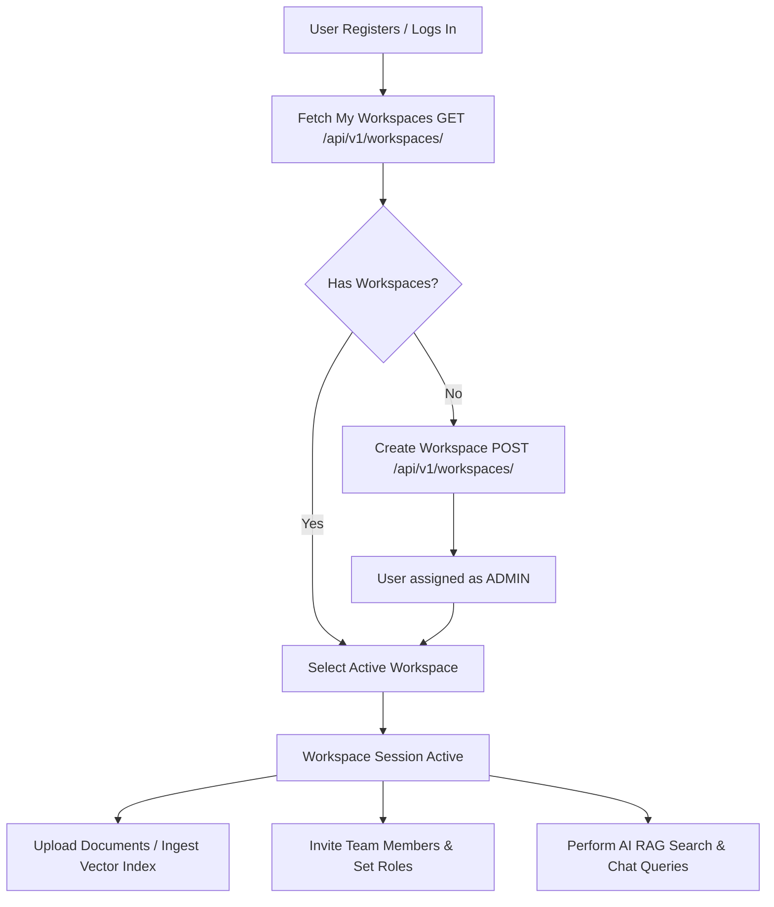

# KnowFlow AI — Workspace Architecture & Flow Guide

## 1. What is a Workspace?
In **KnowFlow AI**, a **Workspace** is a dedicated **multi-tenant security and knowledge boundary**. It isolates all organizational data—including documents, vector embeddings, RAG (Retrieval-Augmented Generation) search indexes, team memberships, and AI chat sessions—ensuring data from one department or client never leaks into another.

---

## 2. Core Features of Workspaces

### 🔒 1. Multi-Tenant Data Isolation
- Each workspace contains its own document library and vector search index.
- Search queries, AI responses, and document uploads are strictly scoped to the active workspace.

### 👥 2. Role-Based Access Control (RBAC)
Every member in a workspace is assigned one of three granular roles:

| Role | Permissions & Capabilities |
| :--- | :--- |
| **`ADMIN`** | Full workspace management: rename/delete workspace, add/remove members, promote/demote roles, manage all documents & RAG settings. *(The creator of a workspace is automatically assigned `ADMIN`)* |
| **`MANAGER`** | Content management: upload/delete documents, view analytics, initiate RAG chats, and update workspace details. |
| **`EMPLOYEE`** | Standard access: search knowledge base, view authorized documents, and participate in AI RAG chat conversations. |

### 🛠️ 3. Member & Access Management
- **Add Members:** Workspace Admins can add existing users by their email address and assign an initial role.
- **Update Roles:** Dynamically promote or demote members (e.g., from `EMPLOYEE` to `MANAGER`).
- **Remove Access:** Revoke member access instantly without deleting user accounts.

---

## 3. End-to-End Workspace Flow

1. **Authentication & Discovery:**
   When a user logs in, the client queries `GET /api/v1/workspaces/` to retrieve all workspaces the user has access to.
2. **Creation:**
   If creating a workspace (e.g., "Engineering Team"), the user sends a `POST` request with the workspace `name` and optional `description`. The creator automatically becomes the `ADMIN`.
3. **Team Onboarding:**
   The `ADMIN` invites team members via `POST /api/v1/workspaces/{workspace_id}/members/` with `email` and `role`.
4. **Isolated RAG Execution:**
   All subsequent API calls (document uploads, semantic search, AI chats) carry the target `workspace_id` header or URL path to ensure queries are strictly bounded to that workspace's vector database.

---

## 4. Complete Workspace API Reference

| Method | Endpoint | Description | Permission Required |
| :--- | :--- | :--- | :--- |
| `GET` | `/api/v1/workspaces/` | List all workspaces user belongs to | Authenticated User |
| `POST` | `/api/v1/workspaces/` | Create a new workspace | Authenticated User |
| `GET` | `/api/v1/workspaces/<id>/` | View workspace details & member count | Workspace Member |
| `PATCH` | `/api/v1/workspaces/<id>/` | Update workspace name/description | Admin / Manager |
| `DELETE`| `/api/v1/workspaces/<id>/` | Deactivate/delete workspace | Workspace Admin |
| `GET` | `/api/v1/workspaces/<id>/members/` | List all members in workspace | Workspace Member |
| `POST` | `/api/v1/workspaces/<id>/members/` | Add member by email & assign role | Workspace Admin |
| `PATCH` | `/api/v1/workspaces/<id>/members/<user_id>/` | Change member role (`ADMIN`, `MANAGER`, `EMPLOYEE`) | Workspace Admin |
| `DELETE`| `/api/v1/workspaces/<id>/members/<user_id>/` | Remove member from workspace | Workspace Admin |
